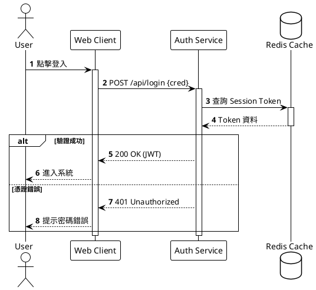
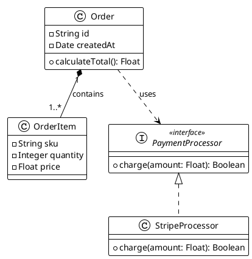
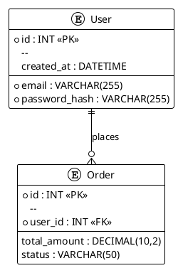
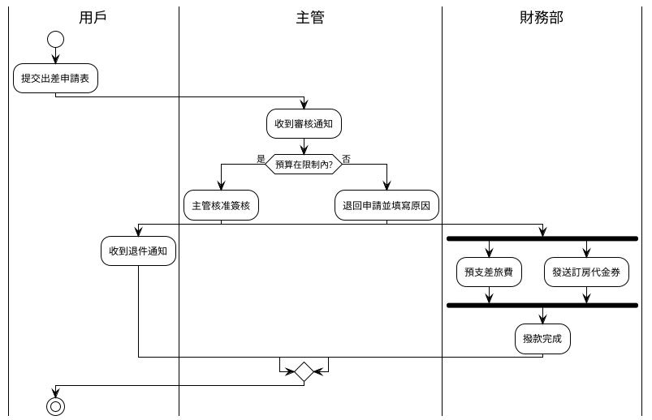
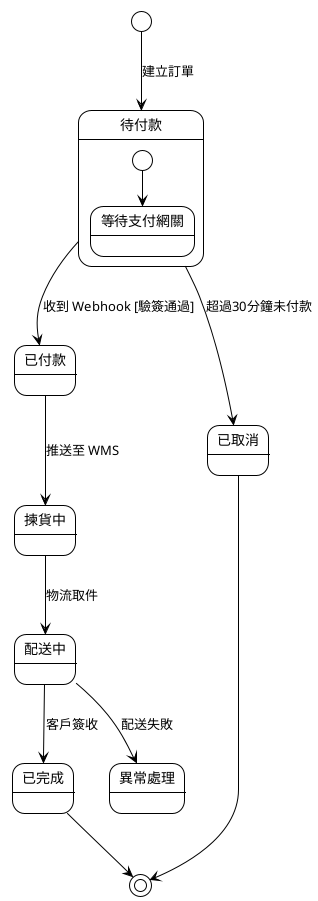
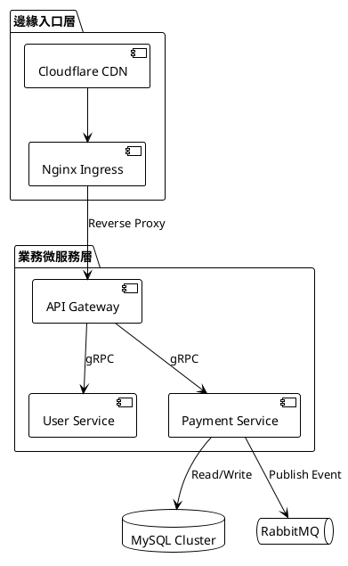
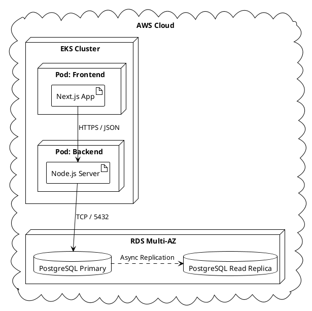
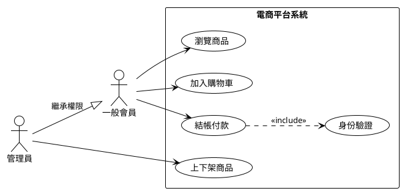
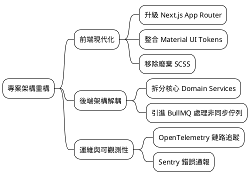
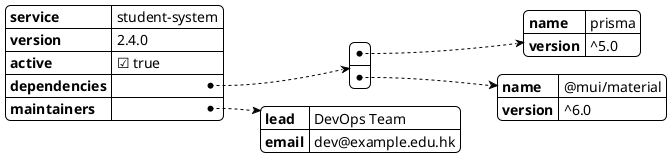

# PlantUML 繪圖技能（本倉守則 × 開源社群十大圖）

整合開源社群最佳實踐（Agents365-ai/plantuml-skill、SpillwaveSolutions/plantuml）與本倉 2026-09-11 實戰踩坑經驗。
先讀 `docx/fix-plan/features/plantuml-techniques.md`（完整技巧）同 `docx/fix-plan/features/plantuml-embedded-mandatory.md`（**強制內嵌規則，2026-09-11 起 inline-only**）。

## 0. 內嵌強制（MUST，畫圖第一優先級）

- **所有圖必須以 ```plantuml 圍欄原碼內嵌喺至少一份 `.md`**——圍欄就係唯一源碼，任何讀 `.md` 嘅人都直接睇到圖。
- **禁止**：只寫 `.puml` 唔內嵌／`.md` 只放圖片引用或文字描述／寫指向 `img/*.puml` 嘅來源註記。
- **禁止另開 sidecar `.puml`**：唔好建立 `img/*.puml` 獨立源檔（唯一例外：`docx/fix-plan/data-flow/img/` 保留做預覽輸出對）。
- 畫圖步驟：**喺 `.md` 直接寫 ```plantuml 圍欄 → 唔好開 `.puml` 檔**。
- VS Code PlantUML extension 喺圍欄內 `Alt+D` 即可預覽。

## 1. 用戶主導原則（AGENTS.md 2026-09-06）

- 預設 AI 只提供「**內容清單**」（要畫咩泳道／流程／決策點／note），**由用戶自己設計**；除非用戶明確要求「幫我畫」，AI 唔好自己生成圖，只負責集成（語法修正、內嵌 `.md`）。

## 2. 全域規範與防錯原則

- **頭尾標籤must成對**：標準圖 `@startuml`/`@enduml`；心智圖 `@startmindmap`/`@endmindmap`；WBS `@startwbs`/`@endwbs`；甘特圖 `@startgantt`/`@endgantt`；結構圖 `@startjson`/`@startyaml`。
- **標準檔頭**（每張圖開頭，置於 `@start...` 之後）：

  ```plantuml
  !theme plain
  skinparam shadowing false
  skinparam defaultFontName "Microsoft JhengHei", "PingFang TC", sans-serif
  ```

- **佈局方向**：由上到下（預設）`top to bottom direction`；由左到右 `left to right direction`。
- **別名 (Alias)**：定義元素一律宣告具名別名（如 `participant "API Gateway" as gateway`），連線時僅使用別名，防止含空格標籤出錯；撞關鍵字就改安全別名（`entity "Class (舊)" as ClassTable`）。

## 3. 十大圖表語法指南

### ① 時序圖 (Sequence Diagram)

- **核心角色**：`actor`, `participant`, `boundary`, `control`, `entity`, `database`, `queue`
- **連線**：`->` 同步請求、`-->` 非同步／虛線返回、`->x` 丟失訊息
- **生命週期**：`activate`/`deactivate`（縮寫 `++`/`--`），**必須配對閉合**
- **邏輯區塊**：`alt/else/end`、`opt/end`、`loop/end`、`par/and/end`；`autonumber` 自動編號



### ② 類別圖 (Class Diagram)

- **可見性**：`+` Public、`-` Private、`#` Protected、`~` Package
- **關係箭頭**：繼承 `<|--`、實現 `<|..`、組合（強）`*--`、聚合（弱）`o--`、關聯 `-->`、依賴 `..>`
- **多重性**：`"1" *-- "0..*"`



### ③ 資料庫實體關聯圖 (ERD)

- **宣告**：`entity "表名" as 別名 { ... }`
- **欄位修飾**：`*` NOT NULL（主鍵）、`o` NULLABLE、`<<FK>>`／`<<PK>>` 標記鍵
- **烏鴉腳基數**：剛好一個 `||--||`、一對多 `||--o{`（零或多）或 `||--|{`（一或多）、多對多 `}o--o{`



### ④ 活動圖 (Activity Diagram — 新版 Beta 語法)

- **起止**：`start`、`stop`／`end`
- **步驟**：`:執行動作;`（**行尾必須半形分號**，全形 `；` 解析失敗）
- **分支**：`if (條件?) then (yes) ... else (no) ... endif`
- **並行**：`fork ... fork again ... end fork`
- **泳道**：`|泳道名稱|`



### ⑤ 狀態圖 (State Diagram)

- **起點／終點**：`[*]`
- **轉換**：`State1 --> State2 : Trigger [Guard] / Action`
- **複合狀態**：`state 名稱 { ... }`；歷史狀態 `[H]`／`[H*]`



### ⑥ 組件與架構圖 (Component Diagram)

- **組件**：`[Component]` 或 `component [Name] as alias`；對外接口 `() "Interface Name"`
- **分組容器**：`package`、`node`、`folder`、`frame`、`cloud`、`database`、`queue`



### ⑦ 部署圖 (Deployment Diagram)

- **節點與實例**：`node`、`artifact`、`agent`、`stack`；展現軟體與硬體／虛擬機（Cloud、K8s Pod）映射
- 方向控制可用 `.right.>`／`.down.>` 等語義方向



### ⑧ 用例圖 (Use Case Diagram)

- **參與者**：`actor "名稱" as 別名` 或 `:Actor Name:`
- **用例**：`(UseCase Name)` 或 `usecase "Name" as alias`
- **擴展／包含**：`..> (UC) : <<include>>`／`<<extend>>`；用例圖多用 `left to right direction`



### ⑨ 心智圖與工作分解結構 (Mindmap / WBS)

- **標籤**：`@startmindmap`／`@startwbs`
- **階層**：`*`（右側）與 `-`（左側），星號越多層級越深



### ⑩ 資料與結構視覺化 (JSON / YAML)

- **標籤**：`@startjson`／`@startyaml`，自動將陣列與鍵值格式化為樹狀方塊



## 4. 大圖排版（>50 節點）：四大「畫死圖」主因與解法

| 病徵 | 根因 | 解法 |
|---|---|---|
| 橫向幼聞（牙籤） | 零連線 → 全部 Rank 0，沿水平軸貪婪排開 | 隱藏約束線強迫換行 |
| 一碌企柱（摩天大樓） | 淨係 `-down->` 唔打橫 | 同層 `-[hidden]right->` 連成行，行間先 `-down->` |
| 45° 階梯打斜 | 跨框直連頂層節點 → 下框頂行同上一框次行同 rank，逐框右移 | **左側垂直主脊樑** |
| **鐵路軌道重疊（Bus Track Collapse）** | **全局技術橫向分層 + `linetype ortho` 導致跨全寬連線被壓在同一像素軌道** | **領域垂直切分（Domain Silos）：按業務拆分垂直泳道，內部直向單向流動，泳道間用 `-[hidden]right->` 並排，跨模組連線改虛線**（實戰出處：`docx/reports/2026-10/2026-10-07/schoolbus-system-design-report.md` 圖 1 四次重構） |

底層原理：Graphviz 純靠箭頭決定 rank。冇箭頭 → 全同 rank；箭頭錯位 → 推擠位移。`-[hidden]->` 佔 rank 唔畫線，係排版最強工具。

### 段落式垂直視圖（防牙籤）

```plantuml
top to bottom direction
package "P1" as P1 {
  entity "A" as A
  entity "B" as B
  entity "C" as C
  entity "D" as D
  entity "E" as E
   ' 行 1 橫排（4–5 個）
  A -[hidden]right-> B
  B -[hidden]right-> C
  C -[hidden]right-> D
   ' 行首 → 下一行行首
  A -[hidden]down-> E
}
```

### 左側垂直主脊樑（防 45° 打斜）

規則：上一框「**最底行最左節點**」`-[hidden]down->` 下一框「**第一行最左節點**」，全部喺最左一欄；每框一條，共 N-1 條。

```
Authenticator -[hidden]down-> Student
TempStudentHW -[hidden]down-> ClassTable
...（12 框即 11 條）...
Book          -[hidden]down-> AuditLog
```

反面教材（會打斜）：`User -[hidden]down-> Student` 直接連第一行。

## 5. URL / HTTP 400 上限

Layer `deflateRaw` 後 ~4KB 以內穩陣（大圖淨係實體名／唔好留欄位；清走 NBSP `\u00A0`）：

```bash
node -e 'const z=require("zlib"),s=require("fs").readFileSync("x.puml","utf8");console.log("deflate KB:",z.deflateRawSync(Buffer.from(s)).length/1024)'
```

## 6. 常見 AI 語法地雷檢驗清單

1. **活動圖分號缺失**：每個步驟文字結尾必須半形 `:步驟描述;`，漏掉直接導致 Graphviz 語法錯誤；全形 `；` 解析失敗。
2. **連線標籤含特殊字元**：標籤含冒號／方括號時用雙引號包裹，如 `A -> B : "process(data: string): void"`。
3. **時序圖生命線未閉合**：有 `activate X` 務必配對 `deactivate X`，避免長方塊一路延伸到底部。
4. **註釋**：單行 `'`；多行 `/' ... '/`。
5. **`Class` 係關鍵字** → `entity "Class (舊)" as ClassTable`；凡撞關鍵字就 `as <安全別名>`。
6. **上色**：activity 用 `<<#Color>>` stereotype 或 `<style>`（唔好 `#Color:` 行首，會被 Markdown 誤判成有序清單＋棄用警告）。
7. **棄用 skinparam**：`skinparam ParticipantPadding/BoxPadding` 已棄用 → 改用 `<style>` 區塊。
8. **NBSP**：圍欄內容唔准含 `\u00A0`，一律半形空格。
9. **容器括號平衡**：package 內 `{`/`}` 要平衡（提早閉合會全場游離節點）；`@start`/`@end` 成對。
10. **連線只用別名**，唔好用含空格嘅顯示標籤直接連線。
11. **圖別關鍵字白名單（2026-09-17 實戰教訓）**：循序圖生命線只用 `actor`/`participant`/`boundary`/`control`/`entity`/`database`/`collections`/`queue`；部署語義轉 `participant "X" as x <<Stereotype>>`，多生命線分組用 `box ... end box`。完整 13 條：`docx/reports/2026-09-17/plantuml-13-syntax-lessons.md`。
12. **宣告 house style**：統一 `[關鍵字] "顯示名稱" as 代號`，名稱含空格／中文／括號／斜線必加雙引號。反向 `participant M1 as "Monitor A"` 亦合法；禁用嘅係未引用多字名稱同 `actor u : Name` 冒號寫法。
13. **容器按圖別判斷**：Sequence 嘅 `boundary` 係生命線，唔可用 `{}` 分組；但 Component 圖嘅 `component app { ... }` 可以合法。Class 元素混入 Deployment／Description 元素時明確加 `allowmixing`，唔好建立跨圖別容器白名單。
14. **註解／樣式**：只有一行首個非空白字元係 `'` 時先開行註解；其他位置嘅 apostrophe 並非一律非法，資料字串仍優先用雙引號。樣式只用 `<style>` 區塊，唔好自創 `style TAG "..."`。
15. **隱藏線必帶 `-` 起首**：`-[hidden]->`／`-[hidden]down->`。child → parent 語法可渲染，但排版約束較難預測，優先同級互連。
16. **活動圖分支／note 錨定**：一個 `if` 淨一個 `else`，3＋ 分支用 `elseif (...) then (...)`；多行 note 用獨立宣告行＋`end note`，單行可用 `note right: 內容`；狀態圖 note 指名具名狀態或使用 named note，唔好隱式黏 `[*]`。
17. **消除逆向拉扯（Rank Inversion，2026-10-08 實戰）**：觸發源（External Cron／Webhook／事件源）唔可以放喺圖底向上指 —— 破壞單向 DAG 會令上下節點互相拉扯、全場 Rank 打架；務必提升至頂層順流而下（cron → API → DB 由上而下）。
18. **大圖慎用全域 `skinparam linetype ortho`**：多層級、跨模組大圖中，直角走線極易令跨全寬連線被壓落同一像素軌道（鐵路軌道重疊，見 §4 第四行）；多泳道佈局一律優先預設曲線（Splines），要直角就只喺局部小圖用。
19. **跨模組依賴連線減噪**：泳道／模組內部呼叫用實線 `-->`；跨模組依賴一律改虛線 `..>` 並標註用途，防止 Graphviz 把長距離連線當高權重邊而打亂排版。配 `-[hidden]right->` 將泳道水平撐開，令 90% 連線留在各自泳道內垂直直達。

## 7. 倉庫風格預設（DB／ERD 圖沿用，直接用）

```plantuml
<style>
package { BackgroundColor #F8FAFC  BorderColor #CBD5E0  FontStyle bold }
entity   { BackgroundColor #FFFFFF BorderColor #718096 }
.spm      { BackgroundColor #D4EFDF BorderColor #38A169 }
.legacy   { BackgroundColor #FADBD8 BorderColor #E53E3E }
.planned  { BackgroundColor #FCF3CF BorderColor #D69E2E }
</style>
entity "SPMStudent" as SPMStudent <<spm>>
```

> 圖例色塊用 `<back:#HEX> </back>`。
> 大圖成品參考（內嵌圍欄範例）：`docx/fix-plan/features/plantuml-techniques.md` §9 及 `docx/reports/` 各報告。

## 8. 收工驗證

```bash
# 無孤兒 .puml（正常應為零，data-flow/img 例外）
find docx -name '*.puml' -not -path '*/data-flow/img/*' | while read f; do
  base=$(basename "$f")
  rg -l "$base" docx --glob '*.md' >/dev/null || echo "MISSING in md: $f"
done
# 無 NBSP
rg -l $'\u00A0' <file> || echo clean
# 成敗對 @startuml/@enduml（喺 .md 圍欄內，用圍欄數量核對）
rg -c '^```plantuml' <file>; rg -c '^@enduml' <file>
```
