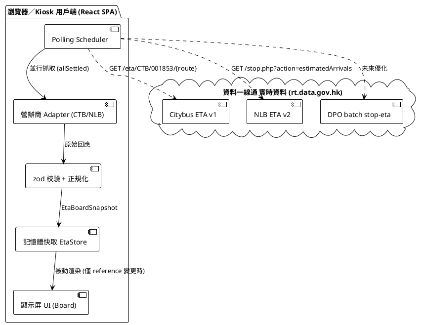
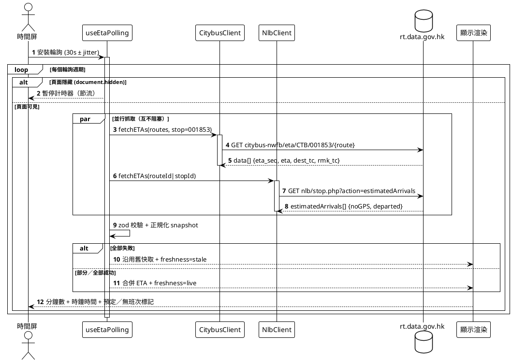
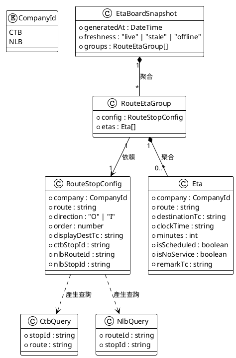
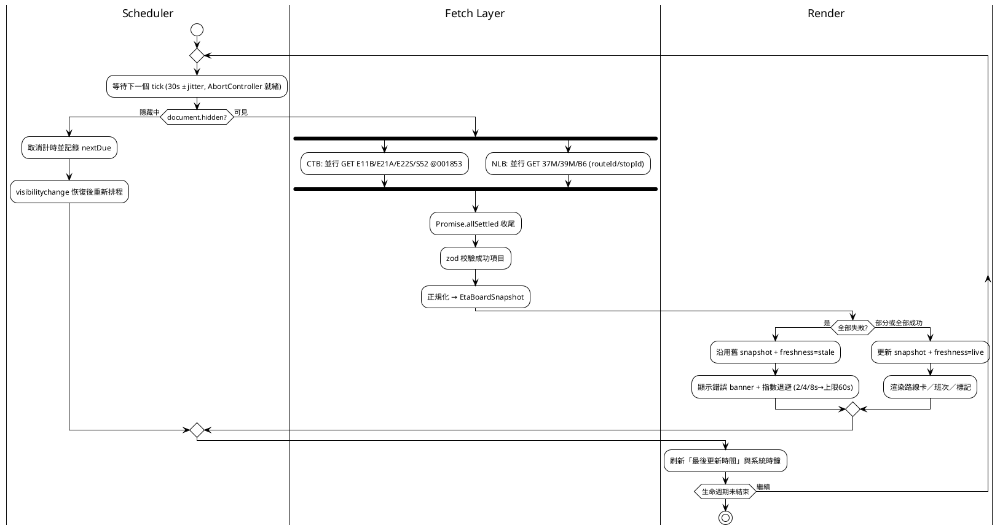
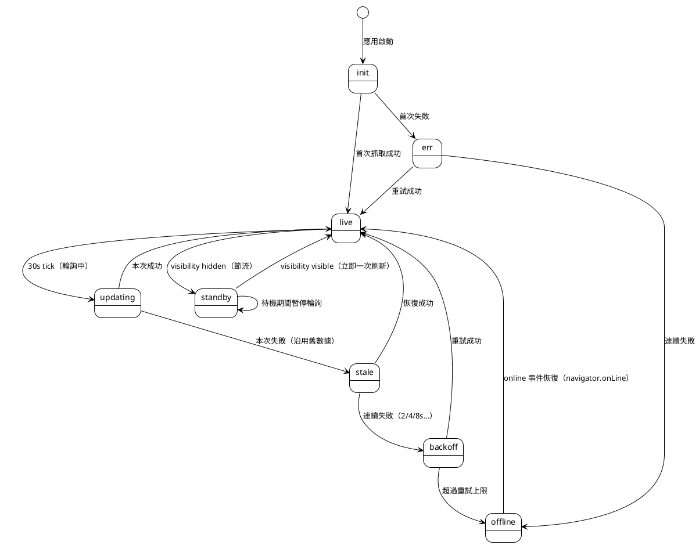
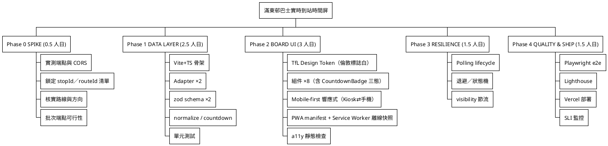
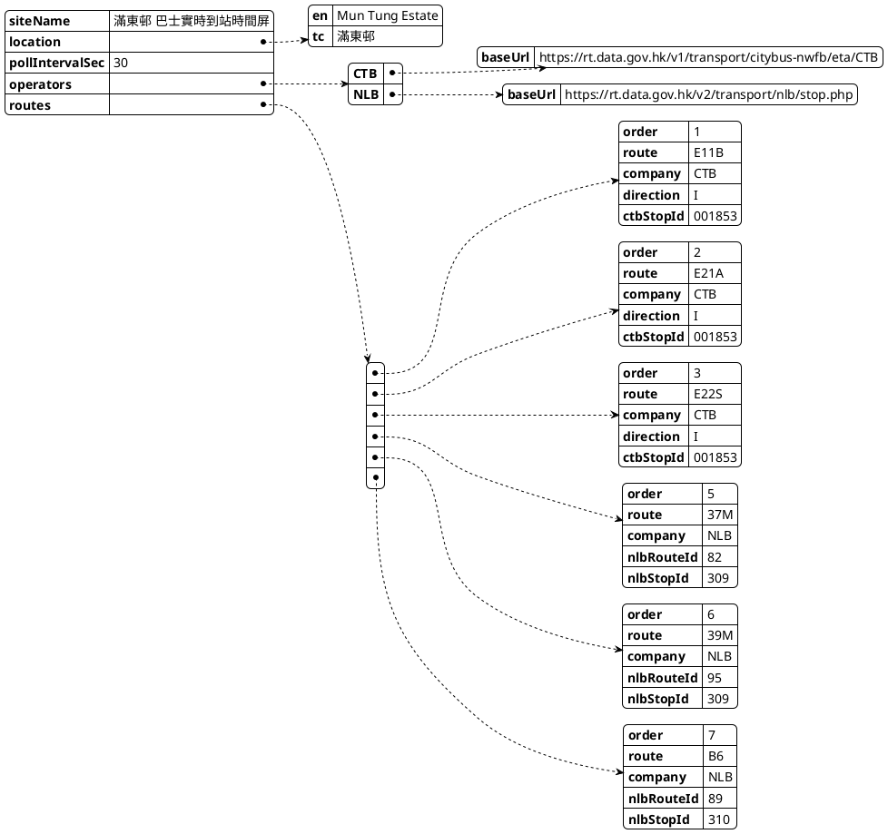

# 滿東邨 巴士實時到站時間屏 —— 完整計劃書

| 項目     | 內容                                                                          |
| -------- | ----------------------------------------------------------------------------- |
| 專案名稱 | 滿東邨 巴士實時到站時間屏（Mun Tung Estate Live Bus Arrival Board）           |
| 文件版本 | v1.1                                                                          |
| 日期     | 2026-10-09                                                                    |
| 狀態     | 計劃審核中（Planning）                                                        |
| 資料來源 | 香港政府「資料一線通」DATA.GOV.HK 開放數據（城巴 / 新大嶼山巴士實時抵站 API） |
| 畫圖工具 | PlantUML（本文件所有圖均以 ````plantuml` 圍欄原碼內嵌）                       |

> **v1.1 更新（2026-10-09）**：① 定案設計語言 **TfL Contrast（倫敦標誌白 × 瑞士國際主義）**，完整規格見 `docs/design-spec.md`；② 定案部署平台 **Vercel Pro**（與其他 project 同帳號集中管理，§12）；③ 定位改為 **Web App 為主、手機優先**（§8.6），大屏 Kiosk 變為次要受眾。

---

## 1. 背景與現況缺口

倉庫內已有一個靜態原型 `index.html`（單頁、無建置流程、寫死樣板）。經代碼審查，現況存在以下缺陷：

| # | 問題                                                                                                      | 影響                                         |
| - | --------------------------------------------------------------------------------------------------------- | -------------------------------------------- |
| 1 | `fetch("https://data.gov.hk")` 抓取的是 **入口網站 HTML**，不是 API；`response.json()` 必然拋錯 | 版面永遠停在「暫時未能獲取任何巴士到站數據」 |
| 2 | 路線清單與站點識別碼（stopId）全部**寫死在 JS 變數**，沒有資料來源校驗                              | 路線一改動即報錯／顯示空卡                   |
| 3 | 無錯誤分離：單一營辦商 API 失敗會污染整板畫面                                                             | 部分服務中斷時欠缺容錯                       |
| 4 | NLB 官方已由 v1 遷移至**v2**（GET query params），原型仍用舊假設                                    | 與官方規格不符                               |
| 5 | 無輪詢生命週期（tabs 隱藏仍續搶資源）、無請求中斷（AbortController）                                      | 資源浪費、重複渲染                           |
| 6 | 無設計體系、無 WCAG 對比度管理、無測試                                                                    | 不適合長期當「顯示屏」產品營運               |

**決策**：不在此原型上打補丁，而是以「完整軟件工程」方式重寫為正式 webapp，保留 `index.html` 作對照／參考（不部署）。

---

## 2. 目標（Goals）與範圍

### 2.1 目標

1. 在單一屏幕上即時展示滿東邨（裕東路／巴士總站）各路線巴士抵站時間（分鐘倒數 + 班次時鐘時間）。
2. 資料來源為政府開放數據（CTV/城巴 + NLB/新大嶼山巴士），免 API key、免費用。
3. 系統具「韌性」：單一路線或單一營辦商 API 故障，不癱瘓整板；能以舊資料 + 鮮度標記續顯示。
4. **Web App 為主，手機優先**：手機瀏覽器一頁即用，單欄排版、大觸控目標、`safe-area` 適配（劉海屏）；支援「加到主畫面」（PWA / Standalone），離線顯示上次快照。
5. 同一代碼庫兼顧「大屏 Kiosk」（全屏、24 小時待機）——以 CSS breakpoints 切換三欄／單欄，不開第二套程式。
6. 可重複、可測試、可部署（Vercel Pro, 同帳號集中管理）、可監控。

### 2.2 非目標（Out of Scope）

- ~~不處理九巴（KMB）／龍運（LWB）路線~~ → **已擴充**：E31/E36A/N31/S64X 經 etabus KMB 資料集接入（含龍運聯營線，`co: "KMB"`），S64/E21B 等剔除（見 docs/api-endpoints.md §1.4/§2.1b）。
- 不做路線規劃／到站推播／多站選擇（列為未來擴充）。
- 不設後台登入／管理界面（路線清單用設定檔管理，commit 為版本）。
- 不做原生 App（iOS/Android SDK）；以 PWA 提供安裝體驗，減少維護面。

### 2.3 成功驗收準則（Definition of Done）

- [ ] 在滿東邨站，8 條已盤點路線全部能顯示 ≥1 個 ETA；無 ETA 時顯示「無班次／未開始服務」而非空白。
- [ ] ETA 每 30 秒自動更新；單路線介面更新以數秒內完成。
- [ ] 拔掉其中一個營辦商（模擬故障）時，其餘營辦商照常顯示，故障方顯示錯誤 banner。
- [ ] **TfL Contrast（倫敦標誌白）**設計系統實作到位（tokens 一致、零陰影、硬線框），1920×1080 大屏與 375×812 手機均正確排版（手機單欄、桌面三欄）。
- [ ] 手機核心：單欄流暢、可手動立即刷新、safe-area 正確、`Lighthouse PWA` installable 通過。
- [ ] `npm run lint`、`npm run test`、`npm run build` 全綠；Playwright 冒煙測試通過。
- [ ] Lighthouse 績效 ≥ 90、a11y ≥ 90。
- [ ] 部署至 **Vercel Pro**（與現有其他 project 同帳號、同 pipeline），HTTPS 可用。

---

## 3. 技術選型（Tech Stack）

| 層面        | 選項                                                                         | 理由                                                                        |
| ----------- | ---------------------------------------------------------------------------- | --------------------------------------------------------------------------- |
| 語言        | TypeScript 5（strict）                                                       | 對 structued data（API 回應、設定）類型安全                                 |
| 框架        | React 18 + Vite 6                                                            | 組件化、生態成熟、輸出純靜態利於 CDN 部署                                   |
| 樣式        | CSS 設計 Token（**TfL 倫敦標誌白 / Swiss Transit** 體系）+ CSS Modules | 顯示屏屬訂製化 UI，毋須重型組件庫；token 統一純白底＋純黑粗線框＋倫敦藍強調 |
| 資料校驗    | zod                                                                          | 對**線上回應**防禦式驗證（營辦商欄位隨時變動）                        |
| PWA         | `vite-plugin-pwa`（manifest + Service Worker）                             | **Web App 為主**：可加到主畫面、Standalone、離線顯示上次快照          |
| 測試        | Vitest（單元+組件）、React Testing Library、Playwright（e2e）                | 全階層覆蓋                                                                  |
| Lint/Format | ESLint flat config + Prettier                                                | 規範統一                                                                    |
| 狀態管理    | 內建 React state + Context（不使用 Redux）                                   | 單屏應用，狀態圖簡單                                                        |
| 部署        | **Vercel Pro**（與其他 project 同帳號、同 pipeline）                   | 集中管理、Serverless 可用（未來代理/快取）、PR previews、內建 Analytics     |
| 監控        | Vercel Analytics + 前端 SLI 埋點（可選 Sentry）                              | 掌握「鮮度」與失敗率                                                        |

### 3.1 為何不用 Next.js／SSR

資料按 30 秒準則更新、由瀏覽器直接輪詢，對 SSR 無需求；純靜態 SPA 最小化延遲與成本。未來若需隱藏代理／邊緣快取，再以 Vercel Serverless Functions 補上（見 §4.5 批次端點與 §13 風險），不影響架構。

### 3.2 為何不用 MUI / AntD

時間屏需要自訂的大字距離、高對比、克制的色彩系統；引入完整組件庫反而增加包體與樣式覆寫成本。UI 基數（路線卡、班次列）只有 3–4 種，槓桿自訂組件更直接。

---

## 4. 資料來源與已實測端點（Spike 產物）

> 以下端點已於 2026-10-09 以 `curl` 實測，可作為實作依據。

### 4.1 城巴 Citybus（CTB）實時 ETA

```
GET https://rt.data.gov.hk/v1/transport/citybus-nwfb/eta/CTB/{stop_id}/{route}
```

- 回應 `data[]`：`route`、`dir`（O=去程/I=回程）、`seq`、`stop`、`dest_tc`／`dest_en`、`eta`（ISO8601+08:00）、`eta_seq`、`rmk_tc`（如「九巴時段」）。
- 實測樣本（stop `001853` = 滿東邨，裕東路）：

```json
{
  "type": "ETA", "version": "1.0",
  "data": [
    {
      "co": "CTB", "route": "E11B", "dir": "O", "seq": 16,
      "stop": "001853", "dest_tc": "東涌(滿東邨)", "dest_en": "Tung Chung (Mun Tung Estate)",
      "eta": "2026-10-09T16:45:17+08:00", "eta_seq": 1, "rmk_tc": ""
    }
  ]
}
```

### 4.2 新大嶼山巴士（NLB）實時 ETA（v2，已遷移）

```
GET https://rt.data.gov.hk/v2/transport/nlb/stop.php?action=estimatedArrivals&routeId={nlbRouteId}&stopId={nlbStopId}&language=zh
```

- 官方已由 v1 遷移至 **v2**：根路徑 `…/v1/transport/nlb/` → `…/v2/transport/nlb/`，且由 POST body 改為 GET query params。
- 回應 `estimatedArrivals[]`：`estimatedArrivalTime`（`YYYY-MM-DD HH:mm:ss`，需正規化為 ISO+08:00）、`routeVariantName`（=「經：」目的地）`departed`、`noGPS`、`wheelChair`、`generateTime`，連同 `message`。
- **關鍵旗標邏輯**：`departed != "1" || noGPS == "1"` → 屬**預定（scheduled）班次**（非 GPS 即時），UI 需顯示「預定」標記。

### 4.3 滿東邨 站點識別碼對應表（已實測確認）

| 營辦商   | 站點                  | 識別碼     | 資料出處                                                        |
| -------- | --------------------- | ---------- | --------------------------------------------------------------- |
| CTB 城巴 | 滿東邨（裕東路）      | `001853` | CTB API`eta/CTB/001853/{route}` 回傳確認（E11B、E21A 有 ETA） |
| NLB      | 滿東邨（裕東路）      | `309`    | NLB`stop.php?action=list&routeId=95`（39M 站序第 3 站）       |
| NLB      | 滿東邨（B6 總站落客） | `310`    | NLB`stop.php?action=list&routeId=88`（B6 最終站）             |

### 4.4 NLB 路線 routeId（已實測）

| 路線 | routeId | 方向                           | 備註     |
| ---- | ------- | ------------------------------ | -------- |
| 37M  | 82      | 迎東邨 → 東涌站（循環）       | 循環線   |
| 39M  | 95      | 東涌站 → 滿東邨（循環）       | 循環線   |
| B6   | 88      | 大橋香港口岸 → 滿東邨         |          |
| B6   | 89      | 滿東邨 → 大橋香港口岸         |          |
| 36X  | 100     | 滿東邨 → 迪士尼樂園           | 擴充候選 |
| 37H  | 96      | 迎東邨 → 北大嶼山醫院（循環） | 擴充候選 |

### 4.5 DPO 批次聚總端點（未來優化，需 spike）

```
GET https://rt.data.gov.hk/v1/transport/batch/stop-eta?{待確認參數}
```

- DPO（Digital Policy Office）提供「單一站點一次取回 CTB+NLB 全部路線 ETA」的批次端點。**Query 參數名稱本計劃未實測確認**，實作前需查閱官方數據字典（`static.data.gov.hk/opendata/eta/bus-route-list-and-eta-specific-stop-api-data-dictionary.pdf`）；若確認可用，可把 8 個請求合併為 1 個（輕量快取 + 更少對上游請求）。

> **驗證注意**：上述門檻（盤點路線是否實際停靠滿東邨）必須以 data.gov.hk 路線→巴士站資料重新核實，取代現在 `index.html` 寫死的清單（尤其 S52 屬逸東邨為主，需確認）。此為「路線盤點 Spike（§7 Phase 0）」。

### 4.6 輪詢頻率與速率預算

- 上游 ETA 每分鐘更新一次；顯示屏設 30s 輪詢（追得上更新、流暢度佳）。
- 速率：`8 路線 × 每 30s ≈ 16 req/min`，遠低於公開 API 合理用量；若採用批次端點則降至 2 req/min。
- 請求加 `?cache=_` 無作用，改用「隨機 jitter（±5s）」避免多台 Kiosk 同步洪峰。

---

## 5. 系統架構（Architecture Overview）

### 5.1 執行流總覽

- **純靜態前端（Vite 打包）** 部署於 Vercel；瀏覽器直接向 `rt.data.gov.hk` 發 CORS 請求（公開數據，無 key）。
- 前端「**全域輪詢 Scheduler**」以單一 `setInterval` + `Promise.allSettled` 並行抓取，避免 8 個獨立 interval 造成抖動與重繪。
- 回應經 **zod 校驗 → 正規化**為內部統一模型（`EtaBoardSnapshot`），再寫入記憶體快取並以**參考相等**方式推給 UI（只有資料變更才重繪）。
- 顯示屏層為**被動渲染**：分鐘倒數由每秒時鐘 tick 驅動，不因輪詢失敗而卡死。

### 5.2 組件架構圖（Component）



### 5.3 一次輪詢的時序圖（Sequence）



---

## 6. 資料模型（Domain Model）

### 6.1 類別圖（Class Diagram）



### 6.2 資料正規化規則

| 來源欄位                                               | 內部模型                    | 轉換                                                                                     |
| ------------------------------------------------------ | --------------------------- | ---------------------------------------------------------------------------------------- |
| CTB`eta`（ISO8601）                                  | `clockTime` / `minutes` | `minutes = ceil((eta - now)/60000)`；`<=0` → 顯示「即將抵站」，並在下一分鐘自動移除 |
| CTB`rmk_tc`                                          | `remarkTc`                | 直接展示（如「九巴時段」）                                                               |
| NLB`estimatedArrivalTime`（`YYYY-MM-DD HH:mm:ss`） | 同上                        | 以`「T」連接 + ".000+08:00"` 正規化為 ISO；同一 done 由 `routeVariantName` 取目的地  |
| NLB`departed`+`noGPS`                              | `isScheduled`             | `noGPS === "1" \|\| departed !== "1"` → 預定班次，UI 顯示「預定」灰標                   |
| 無任何 ETA                                             | `isNoService = true`      | 顯示「無班次／未開始服務」                                                               |

---

## 7. 韌性與生命週期（Resilience）

### 7.1 活動圖（每個輪詢週期）



### 7.2 狀態圖（板面鮮度狀態機）



> 顯示層規則：`stale` → 資料灰化 + 頂部黃色 banner「數據更新中，顯示暫存資料」；`offline` → banner 轉紅色；`err` → 只顯示錯誤卡片，不阻塞其他路線。

### 7.3 上限與降級策略

| 情境                   | 策略                                                                            |
| ---------------------- | ------------------------------------------------------------------------------- |
| 任一路線無 ETA         | 顯示「無班次」佔位，不影響其他卡                                                |
| 單一營辦商整個連線失敗 | 該商全部卡標記錯誤，另一商照常                                                  |
| 全部失敗               | 保留最後快照 +`stale`，指數退避重試（封頂 60s），並在 `online` 事件立即重試 |
| 頁面隱藏（tab 切走）   | 停計時；回到前景立刻刷新一次                                                    |
| Kiosk 螢幕保護／休眠   | 交 OS 處理；board 以`localStorage` 存上次快照，喚醒後可直接恢復舊資料         |

---

## 8. 顯示屏 UX 與視覺設計（TfL Contrast / 瑞士國際主義）

> 設計語言定案：**倫敦標誌白（TfL Contrast）× Swiss Transit**——高飽和倫敦藍、極限純黑粗邊框、純白乾淨底色、零投影零漸變，純靠 1px 級硬線框與字級對比建立階層。心理暗示：官方運作、極度可靠（參 TfL Signs Standard Issue 4、MTR PIDS）。**完整元件規格參考手冊見 [`docs/design-spec.md`](design-spec.md)**（八大元件 + 全套 CSS 代碼範例）。

### 8.1 設計 Token（Design Tokens）

```css
:root {
  /* 基礎表面與文字 */
  --tfl-bg-canvas: #FFFFFF;
  --tfl-bg-subtle: #F4F5F7;
  --tfl-text-black: #000000;
  --tfl-text-muted: #555555;

  /* 核心線框 */
  --tfl-border-color: #222222;
  --tfl-border-width-card: 2.5px;
  --tfl-border-width-inner: 1.5px;
  --tfl-radius: 2px;

  /* 品牌與強調信號色 */
  --tfl-blue: #0019A8;            /* 倫敦藍，Pantone 072 C */
  --tfl-blue-bg: #EBF0FF;
  --color-ctb: #FFD400;           /* 城巴金黃 */
  --color-nlb: #00A651;           /* 嶼巴草綠 */
  --tfl-scheduled-gray: #666666;
  --tfl-alert-red: #D90429;

  /* 字體排印 */
  --tfl-font-sans: "Inter", "Public Sans", "PingFang TC", "Microsoft JhengHei", sans-serif;
  --tfl-font-mono: "JetBrains Mono", "Space Mono", monospace;
}
```

落地位置：`src/styles/tokens.css`（`tokens.module.css` 供 CSS Modules 引用）。

### 8.2 八大核心元件規格

| # | 元件                     | 規格摘要                                                                                                                                                               |
| - | ------------------------ | ---------------------------------------------------------------------------------------------------------------------------------------------------------------------- |
| 1 | BoardHeader & BoardClock | 頂部`border-bottom: 3px solid #222` 貫穿粗黑線；站名 32–38px w800 `-0.5px`；時鐘 倫敦藍/純黑等寬（tabular-nums）含秒；「每 30 秒自動更新」膠囊 `1px solid #222` |
| 2 | OperatorBadge            | 硬色塊 + 1.5px 黑邊：CTB`#FFD400`×黑字、NLB `#00A651`×白字，全大寫 w800，約 54×26px，r2                                                                         |
| 3 | RouteNumber              | 全板視覺錨點；44–56px w900 純黑；等寬/嚴格對齊（E11B、39M）                                                                                                           |
| 4 | DestinationBlock         | `往 TO` 前置（12px w800 #555 + 硬箭頭）＋主目的地 26–30px w700 #000＋循環/途經 meta 14–16px #666 實線小框                                                          |
| 5 | CountdownBadge           | 核心元件，三態分級（§8.3）                                                                                                                                            |
| 6 | EtaRowList               | 卡片內部`border-left: 2px solid #222` 硬切左右兩欄；次班車 18px／20px 轉灰                                                                                           |
| 7 | BusRouteCard             | `#FFF`、`2.5px solid #222`、**`box-shadow: none`**、r2、pb 12px、padding 16–20×14–18px                                                                  |
| 8 | StatusBanner             | 離線：白底`2.5px solid #D90429` + 粗驚嘆號；stale：白底黑黃斜紋頂邊「數據更新中，顯示暫存資料」                                                                      |

### 8.3 CountdownBadge 三態（核心重點）

| 狀態               | 判定                           | 背景             | 邊框                  | 文字                          |
| ------------------ | ------------------------------ | ---------------- | --------------------- | ----------------------------- |
| urgent 即將抵站    | ≤ 2 MIN                       | `#0019A8` 實心 | `2px solid #0019A8` | `#FFF` w900，一眼鎖定       |
| normal 正常等候    | > 2 MIN                        | `#EBF0FF` 淡藍 | `2px solid #0019A8` | 數字`#0019A8`＋黑體 `MIN` |
| scheduled 預定班次 | `noGPS=1` 或 `departed≠1` | `#F4F5F7`      | `1.5px dashed #666` | `#666`＋「預定」小標籤      |

### 8.4 路線卡三段結構（BusRouteCard）

```
┌────────────────────────────────────────────────────────────┐
│ [CTB] E11B   往 TO  天后站 Tin Hau Station   │             │
│       46px       經：銅鑼灣 · 灣仔            │ ▍2 MIN 17:04│
│  (色塊)       (DestinationBlock)      │ ▍17 MIN 17:19│
│                                          │ (硬切線)      │
└────────────────────────────────────────────────────────────┘
                        桌面三欄（140px 路線｜flex 目的地｜ETA 徽章）
```

實際 CSS 架構（`flex + border` 硬切）與完整代碼見 `docs/design-spec.md` §三。

### 8.5 網格與排版紀律

- **零裝飾**：無陰影、無漸變、無 >2px 圓角；階層全靠 1px 細線與字重/字級對比。
- **網格對齊**：路線欄固定 140px，ETA 徽章右對齊，垂直分割線兩側 padding 固定；
- **Kiosk 字級階梯**：標題 40 → 路線號 46–56 → 時間 34 → meta 12–14；手機端等比縮細。

### 8.6 移動端優先（Mobile-First Web App）

> 主要受眾是**手機**，大屏 Kiosk 為次要。同一代碼庫、CSS breakpoints 切換：

| 斷點            | 佈局                                                                                                                                          |
| --------------- | --------------------------------------------------------------------------------------------------------------------------------------------- |
| ≤ 480px 手機   | 卡片直欄化：路線＋目的地一行，ETA 徽章換行於下方並排；路線號縮至 28–32px；`env(safe-area-inset-*)` 內距（劉海屏）；「▼ 立即刷新」觸控按鈕 |
| 481–900px 平板 | 路線｜目的地 兩欄，ETA 徽章靠右                                                                                                               |
| > 900px Kiosk   | 完整三欄 140px｜flex｜徽章，字級最大化                                                                                                        |

- **PWA**：`manifest.webmanifest`（short_name=滿東邨巴士、display=standalone、theme_color `#0019A8`）+ Service Worker（network-first，tw CachingFallback 提供上次快照，並以 freshness 標記）。`viewport-fit=cover`。
- 手機 UX：無懸停依賴（hover 僅桌面裝飾）、觸控最小目標 ≥44px、下拉手動刷新（`aria-live` 提示）。

### 8.7 可及性（WCAG 2.1 AA）

- 色彩不作唯一資訊傳遞（色條旁附公司名稱文字）。
- 對比度（後天設計自帶）：`#000 on #FFF` = **21:1**；`#0019A8 on #FFF` = **10.5:1**（>AAA 7:1）。嶼巴綠底白字（~3.2:1）靠 **TfL Border Enclosure 黑色外框**維持銳利度（可在 Lighthouse 階段驗證是否需要文字換深綠 `#004D26`）。
- 自動更新（30s）不需螢幕閱讀器自動朗讀；重要變更（「即將抵站」）經 `aria-live="polite"` 提示。
- 避免閃爍：無 >3Hz 動畫；分鐘倒數以每秒文字更新（非動畫）。
- 全鍵盤可達；Kiosk 模式無互動需求，hover 只作裝飾。

---

## 9. 專案工作分解（WBS）與里程碑



```plantuml
@startgantt
!theme plain
skinparam shadowing false
skinparam defaultFontName "Microsoft JhengHei", "PingFang TC", sans-serif
project starts 2026-10-12
[Phase 0 SPIKE] as s0 lasts 2 days
[Phase 1 DATA LAYER] as s1 starts s0.end lasts 5 days
[Phase 2 BOARD UI] as s2 starts s1.end lasts 5 days
[Phase 3 RESILIENCE] as s3 starts s2.end lasts 3 days
[Phase 4 QUALITY & SHIP] as s4 starts s3.end lasts 3 days
@enduml
```

---

## 10. Webapp 資料夾結構（Folder Structure）

```
bus/                                    # repo root
├── docs/
│   ├── plan.md                         # 本計劃書（內嵌全部 PlantUML）
│   ├── design-spec.md                  # TfL Contrast 元件規格參考手冊（八大元件＋CSS 範例）
│   ├── api-endpoints.md                # §4 實測端點與資料字典（spike 產物）
│   └── adr/
│       └── 0001-eta-data-layer.md      # ADR：Adapter + zod + 正規化
├── index.html                          # 舊原型（保留做對照，不部署）
├── public/
│   ├── manifest.webmanifest            # PWA：short_name、display=standalone、theme #0019A8
│   ├── favicon.svg / icons/            # 台牌 icon（192/512 maskable）
│   ├── robots.txt
│   └── og-image.png
├── src/
│   ├── app/
│   │   ├── main.tsx                    # 入口（StrictMode + registerSW）
│   │   ├── App.tsx                     # 根佈局
│   │   └── providers/
│   │       └── EtaProvider.tsx         # 全域 EtaBoardSnapshot Context
│   ├── features/
│   │   ├── board/                      # 顯示屏 UI 領域
│   │   │   ├── components/
│   │   │   │   ├── BusBoard.tsx        # 整板容器＋自動捲動（Kiosk）
│   │   │   │   ├── BoardHeading.tsx
│   │   │   │   ├── BoardClock.tsx
│   │   │   │   ├── BusRouteCard.tsx    # 三段式：路線｜目的地｜ETA
│   │   │   │   ├── EtaRow.tsx
│   │   │   │   ├── CountdownBadge.tsx  # urgent/normal/scheduled 三態
│   │   │   │   ├── OperatorBadge.tsx
│   │   │   │   └── StatusBanner.tsx
│   │   │   ├── hooks/
│   │   │   │   ├── useEtaPolling.ts    # 全域輪詢排程（單一 interval）
│   │   │   │   ├── useBoardClock.ts    # 每秒時鐘 / 分鐘重算
│   │   │   │   └── useVisibility.ts
│   │   │   └── Board.test.tsx
│   │   └── eta/                        # 資料取得領域
│   │       ├── clients/
│   │       │   ├── types.ts            # 營辦商原始回應型別
│   │       │   ├── CitybusClient.ts
│   │       │   ├── NlbClient.ts
│   │       │   └── index.ts            # createEtaClient()
│   │       ├── schemas.ts              # zod（CTB / NLB）
│   │       ├── normalize.ts            # 正規化 → Eta[]（§6.2）
│   │       ├── config.ts               # §4.3 路線/站點對應表（單點改動）
│   │       └── __tests__/
│   │           ├── normalize.test.ts
│   │           ├── countdown.test.ts
│   │           └── fixtures/           # 錄製的真實回應樣本
│   ├── shared/
│   │   ├── lib/
│   │   │   ├── time.ts                 # HH:mm / ISO 正規化
│   │   │   ├── countdown.ts
│   │   │   └── retry.ts                # 指數退避
│   │   ├── hooks/
│   │   │   └── useInterval.ts
│   │   └── ui/
│   │       └── tokens.module.css       # TfL 顏色/字級 Token（module 版）
│   ├── styles/
│   │   ├── globals.css
│   │   └── tokens.css                  # TfL CSS custom properties（§8.1）
│   └── assets/                          # 台牌 logo/icon
├── tests/
│   ├── unit/                           # Vitest（額外整合層測試）
│   └── e2e/
│       ├── board.spec.ts               # 冒煙：載入→渲染路線卡→30s 更新
│       └── resilience.spec.ts          # 斷網→ banner→ 恢復
├── scripts/
│   ├── fetch-route-catalog.mjs         # 定期抓路線目錄，產出 config 校驗
│   └── verify-apis.mjs                 # 健康檢查全部§4 端點
├── .env.example
├── .gitignore
├── vite.config.ts
├── tsconfig.json
├── eslint.config.js
├── playwright.config.ts
└── package.json
```

### 階層職責（Dependency Rule）

`board`（展示）→ `eta`（資料）→ `shared`（純函數）；**禁止** `eta` 依賴 `board`、`shared` 不得依賴任何 `features`。如此可獨立測試資料層（fixtures）、獨立抽換 UI。

### 設定檔範例（`src/features/eta/config.ts` 的資料形狀）



> 上表路線名單為**待 spike 核實**的初始草案（含 S52 是否停靠之謎。見 §4.5 驗證注意）。

---

## 11. 測試策略

| 層級   | 工具                  | 覆蓋重點                                                                        |
| ------ | --------------------- | ------------------------------------------------------------------------------- |
| 單元   | Vitest                | countdown 邊界（0 分鐘／跨日）、ISO 正規化、NLB noGPS/預定邏輯、退避序列        |
| 組件   | RTL                   | `EtaRow` 渲染分鐘/時鐘/標記、`StatusBanner` 三態、`BusBoard` 空態         |
| 資料層 | Vitest + fixtures     | 用錄製的真實 CTB/NLB 回應 → normalize 快照測試                                 |
| e2e    | Playwright            | 載入 → 各路線卡出現 → 30s 後「最後更新」時間跳動 → 模擬斷網出 banner → 恢復 |
| 品質   | Lighthouse            | 績效 ≥90、a11y ≥90、SEO ≥90、**PWA installable**                       |
| 視覺   | Playwright screenshot | 1920×1080 Kiosk 三欄 與 375×812 手機單欄，golden 檔對比（含 safe-area 情境）  |

---

## 12. 部署與監控

### 12.1 Hosting 決策記錄（Decision Record）

**決策：Vercel Pro（與其他 project 同一 GitHub 帳號、同一平台集中管理）。** 不採用 GitHub Pages。

| 考量                                                                      | GitHub Pages              | **Vercel Pro（選用）**                 |
| ------------------------------------------------------------------------- | ------------------------- | -------------------------------------------- |
| 與其他 project 同平台管理                                                 | ✘ 分散到 services 設定   | ✔ 統一大面板、同一帳號                      |
| Serverless Functions（未來 batch/stop-eta 代理、邊緣快取、CORS fallback） | **✘ 純靜態不支援** | ✔                                           |
| PR Preview 部署                                                           | 要另設 Actions            | ✔ 內建 per-PR preview                       |
| 內建 Analytics / 觀測                                                     | ✘                        | ✔                                           |
| 建置 pipeline                                                             | 自己寫 workflow           | ✔ push 即部署（現有 deploy-assistant 流程） |
| 成本                                                                      | $0                        | Pro（已訂購）                                |

**額外理由**：本專案定位 **Web App 為主**，PWA／Serverless 升級路徑皆需 Vercel 類平台；GitHub Pages 純靜態在「批次端點快取／隱藏來源／CORS 故障 fallback」上沒有出路。同帳號集中管理減少跨平台切換成本。

**保持 platform-agnostic**：實作仍以 `vite build` 產出純靜態 + Adapter 資料層，不黐死 Vercel 專屬 API；日後搬遷成本維持極低。

### 12.2 部署流程

1. **分支策略**：`main` 為 production；`feature/*` → PR → Vercel preview 自動部署（現有 deploy-assistant 流程）。
2. **PWA 檔案**：`manifest.webmanifest`、Service Worker（`vite-plugin-pwa` 產生）、圖示 192/512 maskable —— 全部為靜態資源，隨 build 輸出。
3. **環境**：`NODE_ENV`、`VITE_API_*` 僅放公開 URL；無任何 Secret（公開數據，不需 key）。若未來加 Serverless Proxy，key 放 Vercel Environment Variables，並由 secrets-auditor 稽核。
4. **上線前檢查**：`npm run verify && npm run lint && npm run test && npm run build && npx playwright test`。
5. **可觀測**：
   - SLI：輪詢成功率、ETA 鮮度（lag 中位數/99th）、`stale` 持續時間、首載至首筆數據時間、SW 命中率。
   - 埋點經 `navigator.sendBeacon`（不阻塞）匯至 Vercel Analytics；錯誤經 Sentry（可選）。
6. **災難恢復**：Vercel 靜態站零狀態；`localStorage` + SW cache 快照供手機離線／Kiosk 喚醒即用。

---

## 13. 風險登記

| 風險                                      | 影響 | 緩解                                                                          |
| ----------------------------------------- | ---- | ----------------------------------------------------------------------------- |
| 上游 CORS 限制（瀏覽器直連失敗）          | 高   | Spike 先驗證；fallback 走 Vercel Serverless Proxy（隱藏來源、加邊緣快取）     |
| 營辦商 API 欄位/版本變更（NLB 已遷 v2）   | 高   | Adapter + zod 雙層隔離；單元測試以 fixtures 錄製變更                          |
| 路線清單過時（總站調動／班次調整）        | 中   | 路線盤點 script 定期刷新 config，並跑 diff                                    |
| Kiosk 瀏覽器節流背景 tab                  | 中   | visibility 暫停/喚醒即時刷新、`AbortController` 清理                        |
| batch/stop-eta 參數不明確                 | 低   | 先以每路線端點上線（Phase 1–4 不受阻），批次優化留 Phase 5                   |
| 大屏內容過多需捲動                        | 低   | 自動捲動＋「捲動暫停於 hover」；必要時 2 屏分頁                               |
| SW 離線快照過舊（手機離線時顯示歷史 ETA） | 中   | 快照附時間戳，超過 N 分鐘標「離線資料」＋提示立即刷新；`network-first` 策略 |
| 手機瀏覽器後台限制（iOS 節流定時器）      | 中   | 前景恢復即時刷新；`visibilitychange` 兜底                                   |

---

## 14. 里程碑與交付時序

| 里程碑          | 時點   | 交付                                                              |
| --------------- | ------ | ----------------------------------------------------------------- |
| M0 計劃書批准   | Day 0  | 本文件（含 Spike 前置研究）                                       |
| M1 Spike 完成   | Day 2  | `docs/api-endpoints.md`、config 定稿                            |
| M2 資料層完成   | Day 7  | 全綠單元/元組測試、fixtures                                       |
| M3 板面 UI 完成 | Day 12 | TfL 三欄/單欄 demo（mock 數據）＋ PWA 安裝成功                    |
| M4 韌性完成     | Day 15 | 狀態機／退避／節流／SW 離線快照                                   |
| M5 上線         | Day 19 | Vercel Pro 部署、Playwright 全綠、Lighthouse PWA 通過、SLI 儀表板 |

下一動作：確認本計劃書後，即開始 **Phase 0 Spike**（實測端點、鎖定路線清單、確認 batch/stop-eta 參數），產出 `docs/api-endpoints.md` 後動工資料層。
